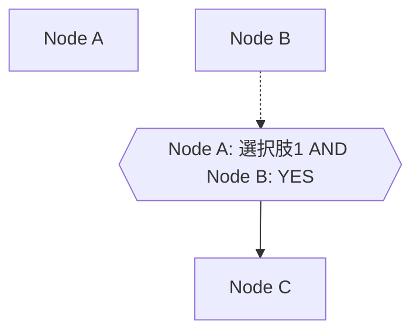
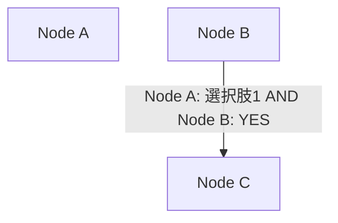

# 複合条件のリファクタリング方針

## 概要

複合条件（CompoundCondition）のデータ構造を簡素化し、状態ノード（hexagon）を廃止する。

## 現在の実装

### データ構造

```typescript
// ノード: 状態ノードが compoundCondition を持つ
const nodes: CustomNode[] = [
  { id: 'node_a', label: 'Node A', shape: 'rectangle', questionCategory: 'MA', choices: [...] },
  { id: 'node_b', label: 'Node B', shape: 'rectangle', questionCategory: 'SA', choices: [...] },
  {
    id: '_state_node_a_xxx_node_b_yyy',
    label: 'Node A: 選択肢1 AND Node B: YES',
    shape: 'hexagon',
    compoundCondition: {
      conditions: [
        { nodeId: 'node_a', conditionType: 'choice', choiceCondition: { choiceIds: ['xxx'] } },
        { nodeId: 'node_b', conditionType: 'choice', choiceCondition: { choiceIds: ['yyy'] } },
      ],
      operator: 'AND',
    },
  },
  { id: 'node_c', label: 'Node C', shape: 'rectangle' },
];

// エッジ: 状態ノードを経由する2つのエッジ
const edges: CustomEdge[] = [
  { from: 'node_b', to: '_state_node_a_xxx_node_b_yyy', label: '複合条件ラベル', style: 'dotted' },
  { from: '_state_node_a_xxx_node_b_yyy', to: 'node_c', label: '', style: 'solid' },
];
```

### Mermaid出力



### 現在の問題点

1. **データの冗長性**: 1つの複合条件に対して、状態ノード + 2つのエッジが必要
2. **管理の複雑さ**: 状態ノードの連鎖削除、ID生成、ラベル同期が必要
3. **コードの複雑さ**: `isStateNode()` による分岐処理が多数存在
4. **サイドパネルの特殊処理**: 状態ノードを非表示にする `displayNodes` フィルタが必要

---

## 提案する実装

### データ構造

```typescript
// ノード: 状態ノードは存在しない
const nodes: CustomNode[] = [
  { id: 'node_a', label: 'Node A', shape: 'rectangle', questionCategory: 'MA', choices: [...] },
  { id: 'node_b', label: 'Node B', shape: 'rectangle', questionCategory: 'SA', choices: [...] },
  { id: 'node_c', label: 'Node C', shape: 'rectangle' },
];

// エッジ: compoundCondition を直接持つ
const edges: CustomEdge[] = [
  {
    from: 'node_b',
    to: 'node_c',
    label: 'Node A: 選択肢1 AND Node B: YES',
    style: 'solid',
    compoundCondition: {
      conditions: [
        { nodeId: 'node_a', conditionType: 'choice', choiceCondition: { choiceIds: ['xxx'] } },
        { nodeId: 'node_b', conditionType: 'choice', choiceCondition: { choiceIds: ['yyy'] } },
      ],
      operator: 'AND',
    },
  },
];
```

### 型定義の変更

```typescript
/** カスタムエッジ（エディタ用） */
export interface CustomEdge {
  from: string;
  to: string;
  label: string;
  style: EdgeStyle;
  /** 単一条件（SA/MA/NA用） */
  condition?: EdgeCondition;
  /** 複合条件（AND条件） */
  compoundCondition?: CompoundCondition;
}

/** カスタムノード（エディタ用） */
export interface CustomNode {
  id: string;
  label: string;
  shape: NodeShape;
  questionCategory?: QuestionCategory;
  choices?: ChoiceOption[];
  // compoundCondition は削除
}
```

### Mermaid出力



状態ノード（hexagon）は表示されず、複合条件はエッジラベルとして表示される。

---

## 実装ステップ

### Phase 1: 型定義の変更

1. `CustomEdge` に `compoundCondition` プロパティを追加
2. `CustomNode` から `compoundCondition` プロパティを削除
3. `STATE_NODE_PREFIX` と `isStateNode()` を削除

### Phase 2: 状態ノード関連コードの削除

削除対象:
- `src/domain/compoundCondition.ts` の `generateStateNodeId()`, `generateStateNodeLabel()`
- `src/lib/hooks/useFlowchartState.ts` の `displayNodes`, `displayEdges` フィルタ
- `src/app/page.tsx` の状態ノード生成ロジック

### Phase 3: エッジ操作の変更

1. **複合条件の作成** (`NodeEditDialog.tsx`):
   - 状態ノードを作成せず、エッジに `compoundCondition` を直接設定
   - エッジは1つのみ作成（from → to）

2. **複合条件の編集** (`EdgeEditDialog.tsx`):
   - エッジの `compoundCondition` を直接編集
   - 状態ノード経由の処理を削除

3. **複合条件の削除**:
   - エッジ削除時に状態ノードの連鎖削除は不要
   - 単純にエッジを削除するのみ

### Phase 4: ラベル生成の変更

1. `generateCompoundConditionEdgeLabel()` を使用してエッジラベルを自動生成
2. 複合条件の内容が変更されたらラベルを再生成

### Phase 5: サイドパネルの簡素化

1. `displayNodes` フィルタを削除（すべてのノードを表示）
2. `displayEdges` フィルタを削除（すべてのエッジを表示）
3. 複合条件エッジの表示を調整（バッジやスタイルで区別）

### Phase 6: 初期データの変更

`src/app/page.tsx` の初期データを新しい形式に変換

---

## 影響範囲

### 変更が必要なファイル

| ファイル | 変更内容 |
|---------|---------|
| `src/types/flowchart.ts` | 型定義の変更、`isStateNode` 削除 |
| `src/domain/compoundCondition.ts` | 状態ノードID/ラベル生成関数の削除 |
| `src/lib/hooks/useFlowchartState.ts` | `displayNodes/Edges` フィルタ削除 |
| `src/lib/hooks/useDialogState.ts` | 状態ノード関連ロジック削除 |
| `src/app/page.tsx` | 初期データ変更、状態ノード生成ロジック削除 |
| `src/components/NodeEditDialog.tsx` | 複合条件作成ロジック変更 |
| `src/components/EdgeEditDialog.tsx` | 複合条件編集ロジック変更 |
| `src/components/Sidebar/index.tsx` | props 変更 |
| `src/components/Sidebar/NodeList.tsx` | `displayNodes` → `nodes` |
| `src/components/Sidebar/EdgeList.tsx` | `displayEdges` → `edges`、複合条件表示 |
| `src/domain/coverage.ts` | 状態ノード関連の処理削除 |
| `src/domain/graphAnalysis.ts` | 状態ノード関連の処理削除 |

### 削除されるコード

- `STATE_NODE_PREFIX` 定数
- `isStateNode()` 関数
- `generateStateNodeId()` 関数
- `generateStateNodeLabel()` 関数
- 状態ノードの連鎖削除ロジック
- `displayNodes` / `displayEdges` フィルタロジック

---

## メリット

1. **データ構造の簡素化**: 1つの複合条件 = 1つのエッジ
2. **コードの簡素化**: 状態ノード関連の分岐処理が不要
3. **管理の容易さ**: エッジ削除 = 複合条件削除（連鎖処理不要）
4. **一貫性**: 単一条件も複合条件も同じエッジ構造

## デメリット・トレードオフ

1. **視覚的表現の変化**: hexagonノードがなくなり、複合条件はラベルのみで表現
2. **既存データの移行**: 現在の状態ノード形式からの変換が必要

---

## 考慮事項

### 複合条件の視覚的区別

複合条件を持つエッジを視覚的に区別する方法:

1. **ラベルのプレフィックス**: `[AND] Node A: 選択肢1 AND Node B: YES`
2. **エッジスタイル**: 複合条件エッジは太線（`thick`）で表示
3. **サイドパネルのバッジ**: 複合条件エッジに「AND」バッジを表示

### 将来の拡張性

- OR条件対応時も同じ構造で対応可能（`operator: 'OR'`）
- デフォルトエッジとの共存も問題なし

---

## テストケース

### 正常系

1. 複合条件エッジの作成 → エッジに `compoundCondition` が設定される
2. 複合条件エッジの編集 → `compoundCondition` が更新される
3. 複合条件エッジの削除 → エッジのみ削除される
4. Mermaid生成 → ラベル付きエッジとして出力される

### 異常系

1. 複合条件の条件が0個 → エラーまたは通常エッジとして扱う
2. 複合条件の条件が1個 → 単一条件として扱う or 警告表示
